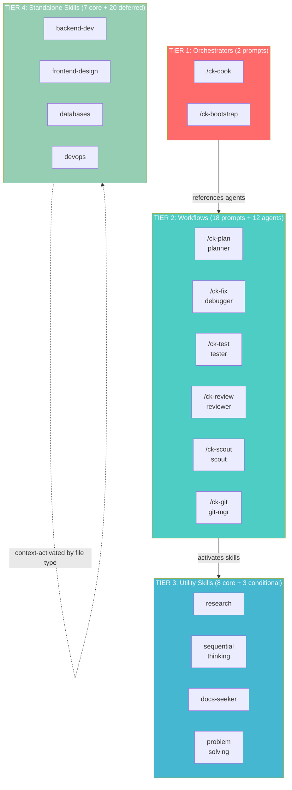
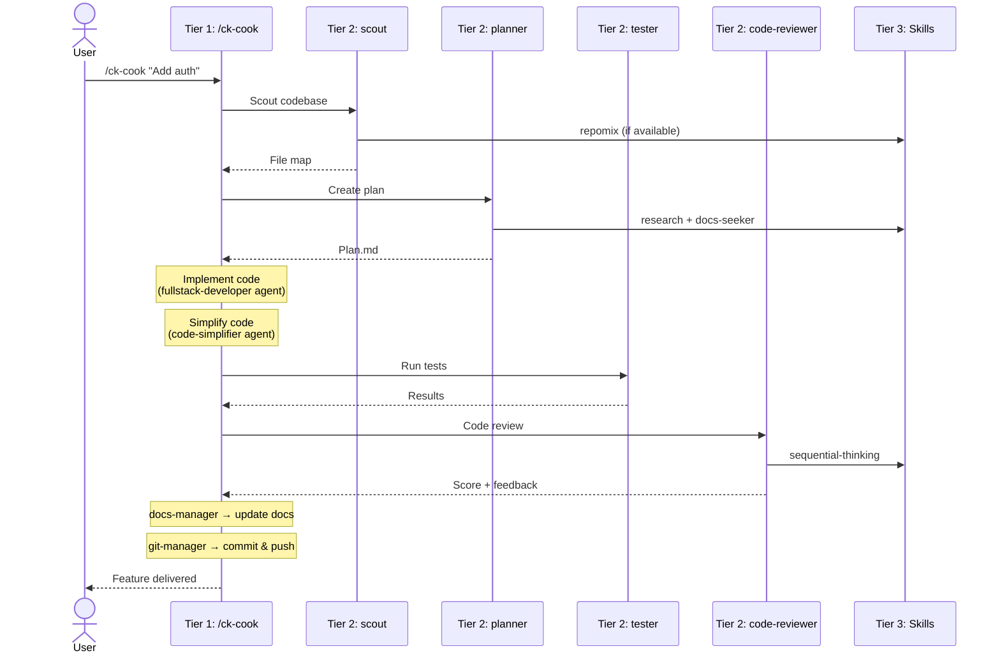

# Skills & Orchestration Layer - Training Slides

---

## Slide 1: The Problem — Why Chat-Style AI Coding Falls Short

### Level 0: Raw Prompting (What most devs do today)

```
You:   "Add user authentication"
AI:    Here's a basic auth implementation... [shallow code snippet]
You:   "No, I need JWT tokens"
AI:    Here's JWT... [another snippet, no context from before]
You:   "It doesn't work with my existing User model"
AI:    Can you paste your User model? [lost all prior context]
You:   [pastes 200 lines] "Now fix the middleware too"
AI:    [hallucinated middleware that doesn't match your codebase]
...
45 minutes later: scattered code, no tests, no docs, manual copy-paste
```

**Pain points:**
- **Shallow work** — AI gives generic snippets, not production code
- **No codebase awareness** — doesn't know your files, patterns, conventions
- **Context evaporates** — each message starts from scratch
- **Manual everything** — you copy-paste, test, review, commit yourself
- **No quality gates** — no one checks the AI's output before you ship it

### Level 1: Skills (Better, but still fragmented)

Skills give AI **domain expertise** — how to write backends, style UIs, test properly. But standalone skills are isolated. Each does one thing well in a vacuum:

```
/skill-backend    → generates API code      ...but who plans it?
/skill-test       → writes test cases       ...but who runs them?
/skill-review     → reviews code quality    ...but who fixes issues?
/skill-git        → commits changes         ...but who coordinates?
```

Skills without orchestration = **a toolbox with no builder**. You still manually chain them.

### Level 2: Orchestration (The missing layer)

What if one command could **plan, code, test, review, and ship** — automatically?

```
/ck-cook "Add user auth"
  │
  ├─ 1. Scout      → scout agent scans codebase, finds relevant files
  ├─ 2. Research    → researcher agents gather information (parallel)
  ├─ 3. Plan        → planner agent designs architecture & analysis
  ├─ 4. Implement   → fullstack-developer agent writes code (parallel mode)
  ├─ 5. Simplify    → code-simplifier agent refines code
  ├─ 6. Test        → tester agent runs tests, debugger agent if failures
  ├─ 7. Review      → code-reviewer agent evaluates quality
  └─ 8. Finalize    → docs-manager updates docs, git-manager commits
```

**10 agents** orchestrated by **1 command**. The rest is handled automatically.

### The Progression

```
┌─────────────┐     ┌─────────────┐     ┌─────────────────────┐
│  Level 0    │     │  Level 1    │     │  Level 2            │
│  RAW CHAT   │ ──> │  SKILLS     │ ──> │  ORCHESTRATION      │
│             │     │             │     │                     │
│ • Shallow   │     │ • Deep but  │     │ • Deep AND          │
│ • No context│     │   isolated  │     │   coordinated       │
│ • Manual    │     │ • Manual    │     │ • Automatic          │
│ • No gates  │     │   chaining  │     │ • Quality gates     │
│             │     │             │     │ • 10 agents, 1 cmd  │
│ 45 min/feat │     │ 20 min/feat │     │ 5 min/feat          │
└─────────────┘     └─────────────┘     └─────────────────────┘
```

**CoKit operates at Level 2.** That's the difference.

---

## Slide 2: What Is the Orchestration Layer?

The system that **coordinates AI agents, prompts, and skills** to deliver end-to-end development workflows.

```
┌──────────────────────────────────────────────────────┐
│            USER: /ck-cook "Add user auth"            │
└──────────────┬───────────────────────────────────────┘
               ▼
┌──────────────────────────────────────────────────────┐
│       ORCHESTRATION LAYER (4 Tiers)                  │
│                                                      │
│  Tier 1 → Tier 2 → Tier 3 → Tier 4                  │
│  (command) (execute) (tools) (domain knowledge)      │
│                                                      │
└──────────────┬───────────────────────────────────────┘
               ▼
┌──────────────────────────────────────────────────────┐
│            DELIVERED FEATURE                         │
│    Code + Tests + Docs + Commit                      │
└──────────────────────────────────────────────────────┘
```

Without orchestration → you prompt one step at a time.
With orchestration → 1 command triggers the full pipeline.

---

## Slide 3: The Numbers at a Glance

| Resource | Count | Purpose |
|----------|-------|---------|
| **Tiers** | **4** | Layered hub-and-spoke architecture |
| **Prompts** | **34** | Command templates (18 core + 10 variants + 6 spec) |
| **Agents** | **12** | Specialized AI personas |
| **Skills** | **27** | Domain expertise packages |
| **Instructions** | **5** | Context-aware rules auto-loaded by file type |
| **Collections** | **5** | Bundled resource groups |
| **Rules** | **4** | Orchestration protocol files |

**Total: 87 resources** across 4 tiers.

---

## Slide 4: 4-Tier Architecture Overview



**Rule:** Each tier only calls DOWN. No circular dependencies. No upward calls.

| Tier | Role | Answers |
|------|------|---------|
| 1 | End-to-end workflow controllers | **WHAT** to do and in what order |
| 2 | Domain-specific executors | **HOW** to do each step |
| 3 | Reusable capability providers | **WITH WHAT** methodology |
| 4 | Self-contained domain experts | **ABOUT WHAT** domain |

---

## Slide 5: Tier 1 — Orchestrators

**2 prompts** | End-to-end workflow controllers

| Prompt | What it does | Agents it references |
|--------|-------------|---------------------|
| `/ck-cook` | Full pipeline: Scout → Research → Plan → Implement → Simplify → Test → Review → Finalize | researcher, scout, planner, ui-ux-designer, fullstack-developer, code-simplifier, tester, debugger, code-reviewer, docs-manager, git-manager |
| `/ck-bootstrap` | New project scaffolding | researcher, planner |

**Think of it as:** The project manager that knows all steps and delegates to specialists.

Cook has **6 modes** based on input detection:

| Mode | Trigger | Behavior |
|------|---------|----------|
| interactive | default | User approval at each gate |
| auto | "auto", "trust me" | Auto-approve if score ≥ 9.5 |
| fast | "fast", "quick" | Skip research phase |
| parallel | "parallel", 3+ features | Multi-agent execution |
| no-test | "no test", "skip test" | Skip testing step |
| code | path to plan.md | Execute existing plan |

---

## Slide 6: Tier 2 — Workflow Prompts + Agents

**18 prompts + 12 agents** | Each command = **Prompt** (workflow) + **Agent** (persona)

| Category | Commands | Agent | Skills activated |
|----------|----------|-------|-----------------|
| Planning | `/ck-plan`, `-fast`, `-hard`, `-validate`, `-red-team` | `planner` | planning, research, docs-seeker |
| Scouting | `/ck-scout` | `scout` | repomix (if available) |
| Debugging | `/ck-debug` | `debugger` | debug methodology (4 phases) |
| Fixing | `/ck-fix`, `-types`, `-test`, `-ci`, `-ui`, `-fast`, `-hard`, `-logs` | `debugger` | debug, problem-solving, sequential-thinking |
| Testing | `/ck-test` | `tester` | web-testing |
| Review | `/ck-review` | `code-reviewer` | sequential-thinking |
| Brainstorm | `/ck-brainstorm` | `brainstormer` | research, docs-seeker |
| Simplify | `/ck-simplify` | `code-simplifier` | — |
| Git | `/ck-git` | `git-manager` | git |
| Docs | `/ck-docs` | `docs-manager` | docs-seeker |
| Q&A | `/ck-ask`, `/ck-watzup` | (none) | context-dependent |

**12 agents** serve **18 prompts** — `debugger` alone powers 9 prompt variants.

### Prompt Navigation (Not Cross-Hub Orchestration)

Tier 2 prompts link to each other via **"Suggested Next Steps"** footers:

```
/ck-fix → suggests → /ck-test, /ck-git
/ck-test → suggests → /ck-fix, /ck-review, /ck-git
/ck-brainstorm → suggests → /ck-plan (step 8: "Create implementation plan?")
/ck-review → suggests → /ck-fix, /ck-git
```

This is **sequential prompt chaining** (user chooses next step), NOT automatic cross-hub orchestration. The user decides whether to follow suggested navigation.

---

## Slide 7: Tier 3 — Utility Skills

**8 core + 3 conditional** | Reusable, stateless capability providers

```
                    ┌──────────────────┐
    ┌──────────────>│  sequential-     │<──────────────┐
    │               │  thinking        │               │
    │               └──────────────────┘               │
    │                      ▲                           │
┌───┴────────┐      ┌──────┴──────────┐       ┌───────┴──┐
│ debugger   │      │ code-reviewer   │       │ planner  │
└────────────┘      └─────────────────┘       └──────────┘

→ 1 skill serves MANY agents = DRY principle
→ Leaf nodes: never call other skills
→ Loaded only when context matches = token efficient
```

| Skill | Capability | Referenced by |
|-------|-----------|---------------|
| **research** | Web search, docs synthesis | planner, brainstormer |
| **docs-seeker** | Library docs via context7 | planner, brainstormer, docs-manager |
| **sequential-thinking** | Step-by-step reasoning | debugger, planner, code-reviewer, brainstormer |
| **problem-solving** | Systematic stuck-ness techniques | debugger (fix skill) |
| **agent-browser** | Browser automation CLI | debugger (fix-ui), tester |
| **repomix** *(if available)* | Pack repo for AI | scout |
| **context-engineering** | Token optimization | any agent when constrained |
| **mermaidjs-v11** | Diagram syntax v11 | planner, visual generation |
| **ui-ux-pro-max** *(if available)* | Design intelligence | ui-ux-designer |
| **ai-multimodal** *(if available)* | Image/video analysis (Gemini) | any agent needing vision |
| **media-processing** *(if available)* | FFmpeg/ImageMagick | any agent needing media ops |

---

## Slide 8: Tier 4 — Standalone Skills

**7 core + 20 deferred** | Self-contained domain experts, no CoKit core dependency

| Category | Skills |
|----------|--------|
| Backend | `backend-development`, `databases`, `devops` |
| Frontend | `frontend-design`, `ui-styling` |
| Testing | `web-testing` |
| Git | `git` |
| MCP | `mcp-management` |

**How they differ from Tier 3:**
- Tier 3: **Methodology** — how to think, research, debug
- Tier 4: **Domain knowledge** — how to build backends, style UIs, deploy

**Pluggable:** Add `skills/ck-new-skill/SKILL.md` → auto-discovered by context. No changes elsewhere.

---

## Slide 9: The Full Communication Flow



---

## Slide 10: Design Principles

### 1. Hub-and-Spoke (Not Mesh)
Orchestrators (hub) delegate to specialists (spokes). **No peer-to-peer** agent communication. Tier 2 prompts suggest next steps to each other, but the **user decides** — it's navigation, not automatic orchestration.

### 2. Separation of Concerns
Each resource does ONE thing well:
- **Prompt** = defines a workflow
- **Agent** = defines expertise/persona
- **Skill** = provides knowledge/methodology

### 3. DRY via Shared Skills
`sequential-thinking` written once → used by debugger, planner, code-reviewer, brainstormer.

### 4. Graceful Degradation
External tools use `(if available)`. Missing repomix? Scout falls back to built-in search.

### 5. Pluggable Architecture
New skill = new SKILL.md file. No registration. No changes to prompts. Context-activated.

---

## Slide 11: Cheat Sheet

```
┌─────────────────────────────────────────────────────────────┐
│                 COKIT ORCHESTRATION CHEAT SHEET              │
├─────────────────────────────────────────────────────────────┤
│                                                             │
│  TIER 1 (2)    /ck-cook, /ck-bootstrap                     │
│  ─────────     Full workflow controllers                    │
│                                                             │
│  TIER 2 (30)   18 prompts + 12 agents                      │
│  ─────────     /ck-plan, /ck-fix, /ck-test, /ck-review...  │
│                Domain-specific executors                     │
│                                                             │
│  TIER 3 (11)   8 core + 3 conditional skills               │
│  ─────────     research, sequential-thinking, docs-seeker   │
│                Reusable capability providers                 │
│                                                             │
│  TIER 4 (27)   7 core + 20 deferred skills                 │
│  ─────────     backend-dev, databases, devops, ui-styling   │
│                Self-contained domain experts                 │
│                                                             │
│  TOTAL: 4 tiers │ 34 prompts │ 12 agents │ 27 skills       │
│          5 instructions │ 5 collections │ 4 rules           │
│                                                             │
│  ONE COMMAND TO RULE THEM ALL: /ck-cook                     │
│                                                             │
└─────────────────────────────────────────────────────────────┘
```

---

## Slide 12: Try It Yourself

| Want to... | Run |
|-----------|-----|
| Build a feature end-to-end | `/ck-cook "description"` |
| Plan before building | `/ck-plan "description"` |
| Fix a bug | `/ck-fix "error message"` |
| Fix TypeScript errors | `/ck-fix-types` |
| Run & analyze tests | `/ck-test` |
| Review code quality | `/ck-review` |
| Search the codebase | `/ck-scout "what to find"` |
| Brainstorm solutions | `/ck-brainstorm "problem"` |
| Quick answer | `/ck-ask "question"` |
| Commit changes | `/ck-git` |

**Pro tip:** Start with `/ck-cook` — it orchestrates everything else automatically.
