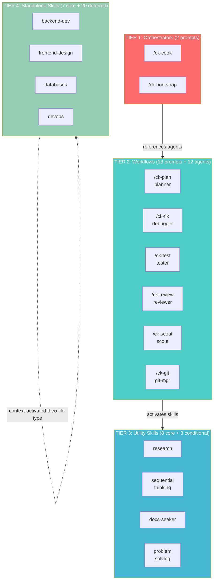
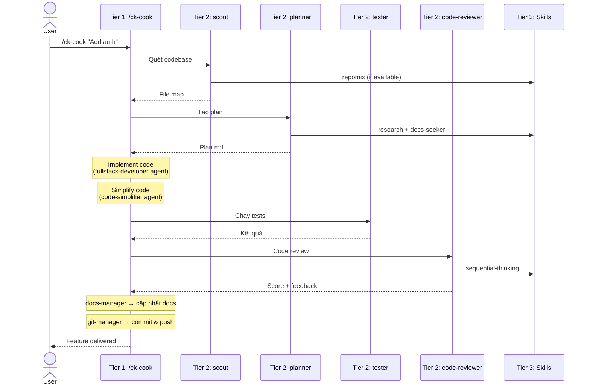

# Skills & Orchestration Layer - Training Slides (Tiếng Việt)

---

## Slide 1: Vấn Đề — Tại Sao Chat-Style AI Coding Không Đủ

### Level 0: Raw Prompting (Cách đa số dev đang làm)

```
Bạn:   "Thêm user authentication"
AI:    Đây là basic auth... [code snippet hời hợt]
Bạn:   "Không, tôi cần JWT tokens"
AI:    Đây là JWT... [snippet khác, mất hết context trước đó]
Bạn:   "Nó không hoạt động với User model của tôi"
AI:    Bạn paste User model được không? [đã mất toàn bộ context]
Bạn:   [paste 200 dòng] "Giờ fix middleware luôn"
AI:    [hallucinate middleware không khớp codebase của bạn]
...
45 phút sau: code rời rạc, không tests, không docs, copy-paste thủ công
```

**Pain points:**
- **Shallow work** — AI cho snippet chung chung, không phải production code
- **Không biết codebase** — không biết files, patterns, conventions của bạn
- **Context bay hơi** — mỗi message bắt đầu lại từ đầu
- **Thủ công hết** — bạn tự copy-paste, test, review, commit
- **Không quality gates** — không ai kiểm tra output của AI trước khi ship

### Level 1: Skills (Tốt hơn, nhưng vẫn rời rạc)

Skills cho AI **domain expertise** — cách viết backend, style UI, test đúng cách. Nhưng standalone skills bị cô lập. Mỗi cái làm tốt một việc trong chân không:

```
/skill-backend    → generate API code      ...nhưng ai plan?
/skill-test       → viết test cases        ...nhưng ai chạy?
/skill-review     → review code quality    ...nhưng ai fix issues?
/skill-git        → commit changes         ...nhưng ai điều phối?
```

Skills không có orchestration = **hộp đồ nghề mà không có thợ xây**. Bạn vẫn phải tự chain thủ công.

### Level 2: Orchestration (Tầng còn thiếu)

Nếu 1 command có thể **plan, code, test, review, và ship** — tự động?

```
/ck-cook "Add user auth"
  │
  ├─ 1. Scout      → scout agent quét codebase, tìm file liên quan
  ├─ 2. Research    → researcher agents thu thập thông tin (parallel)
  ├─ 3. Plan        → planner agent lên kiến trúc và phân tích
  ├─ 4. Implement   → fullstack-developer agent code (parallel mode)
  ├─ 5. Simplify    → code-simplifier agent refine code
  ├─ 6. Test        → tester agent chạy tests, debugger agent nếu fail
  ├─ 7. Review      → code-reviewer agent đánh giá chất lượng
  └─ 8. Finalize    → docs-manager cập nhật docs, git-manager commit
```

**10 agents** được orchestrate bởi **1 command**. Phần còn lại CoKit tự lo.

### Con Đường Tiến Hoá

```
┌─────────────┐     ┌─────────────┐     ┌─────────────────────┐
│  Level 0    │     │  Level 1    │     │  Level 2            │
│  RAW CHAT   │ ──> │  SKILLS     │ ──> │  ORCHESTRATION      │
│             │     │             │     │                     │
│ • Hời hợt   │     │ • Sâu nhưng │     │ • Sâu VÀ            │
│ • Mất context│    │   rời rạc   │     │   phối hợp          │
│ • Thủ công  │     │ • Vẫn chain │     │ • Tự động           │
│ • Không gate│     │   thủ công  │     │ • Quality gates     │
│             │     │             │     │ • 10 agents, 1 cmd  │
│ 45 phút/feat│     │ 20 phút/feat│     │ 5 phút/feat         │
└─────────────┘     └─────────────┘     └─────────────────────┘
```

**CoKit hoạt động ở Level 2.** Đó là sự khác biệt.

---

## Slide 2: Orchestration Layer Là Gì?

Hệ thống **phối hợp AI agents, prompts, và skills** để deliver workflow phát triển end-to-end.

```
┌──────────────────────────────────────────────────────┐
│            USER: /ck-cook "Add user auth"            │
└──────────────┬───────────────────────────────────────┘
               ▼
┌──────────────────────────────────────────────────────┐
│       ORCHESTRATION LAYER (4 Tiers)                  │
│                                                      │
│  Tier 1 → Tier 2 → Tier 3 → Tier 4                  │
│  (chỉ huy) (quản lý) (công cụ) (chuyên gia)        │
│                                                      │
└──────────────┬───────────────────────────────────────┘
               ▼
┌──────────────────────────────────────────────────────┐
│            DELIVERED FEATURE                         │
│    Code + Tests + Docs + Commit                      │
└──────────────────────────────────────────────────────┘
```

Không có orchestration → bạn prompt từng bước một.
Có orchestration → 1 command trigger cả pipeline.

---

## Slide 3: Tổng Quan Con Số

| Resource | Số lượng | Mục đích |
|----------|---------|----------|
| **Tiers** | **4** | Kiến trúc hub-and-spoke phân tầng |
| **Prompts** | **34** | Command templates (18 core + 10 variants + 6 spec) |
| **Agents** | **12** | AI personas chuyên biệt |
| **Skills** | **27** | Gói domain expertise |
| **Instructions** | **5** | Rules tự động load theo file type |
| **Collections** | **5** | Nhóm resources đóng gói |
| **Rules** | **4** | File protocol orchestration |

**Tổng cộng: 87 resources** hoạt động xuyên suốt 4 tiers.

---

## Slide 4: Kiến Trúc 4 Tầng



**Nguyên tắc:** Mỗi tier chỉ gọi XUỐNG. Không circular dependencies. Không gọi ngược lên.

| Tier | Tên Việt | Vai trò | Trả lời câu hỏi |
|------|----------|---------|-----------------|
| 1 | Tầng Chỉ Huy | Điều phối workflow end-to-end | **LÀM GÌ** và theo thứ tự nào |
| 2 | Tầng Quản Lý Trung Gian | Thực thi từng domain cụ thể | **LÀM NHƯ THẾ NÀO** cho mỗi bước |
| 3 | Tầng Công Cụ Thuần Tuý | Cung cấp capability tái sử dụng | **BẰNG PHƯƠNG PHÁP GÌ** |
| 4 | Tầng Chuyên Gia Độc Lập | Domain expert tự đủ | **VỀ LĨNH VỰC NÀO** |

---

## Slide 5: Tier 1 — Orchestrators (Tầng Chỉ Huy)

**2 prompts** | Điều phối workflow end-to-end

| Prompt | Chức năng | Agents sử dụng |
|--------|----------|----------------|
| `/ck-cook` | Full pipeline: Scout → Research → Plan → Implement → Simplify → Test → Review → Finalize | researcher, scout, planner, ui-ux-designer, fullstack-developer, code-simplifier, tester, debugger, code-reviewer, docs-manager, git-manager |
| `/ck-bootstrap` | Khởi tạo project mới | researcher, planner |

**Hình dung:** Giống project manager — biết tất cả các bước và delegate cho từng chuyên gia.

Cook có **6 modes** dựa trên input detection:

| Mode | Kích hoạt khi | Hành vi |
|------|--------------|---------|
| interactive | mặc định | User approve từng gate |
| auto | "auto", "trust me" | Tự approve nếu score ≥ 9.5 |
| fast | "fast", "quick" | Bỏ qua research phase |
| parallel | "parallel", 3+ features | Multi-agent execution |
| no-test | "no test", "skip test" | Bỏ qua testing |
| code | path tới plan.md | Execute plan có sẵn |

---

## Slide 6: Tier 2 — Workflows (Tầng Quản Lý)

**18 prompts + 12 agents** | Mỗi command = **Prompt** (workflow) + **Agent** (persona)

| Nhóm | Commands | Agent | Skills kích hoạt |
|------|----------|-------|-----------------|
| Planning | `/ck-plan`, `-fast`, `-hard`, `-validate`, `-red-team` | `planner` | planning, research, docs-seeker |
| Scouting | `/ck-scout` | `scout` | repomix (if available) |
| Debugging | `/ck-debug` | `debugger` | debug methodology (4 phases) |
| Fixing | `/ck-fix`, `-types`, `-test`, `-ci`, `-ui`, `-fast`, `-hard`, `-logs` | `debugger` | debug, problem-solving, sequential-thinking |
| Testing | `/ck-test` | `tester` | web-testing |
| Review | `/ck-review` | `code-reviewer` | sequential-thinking |
| Brainstorm | `/ck-brainstorm` | `brainstormer` | research, docs-seeker |
| Simplify | `/ck-simplify` | `code-simplifier` | — |
| Git | `/ck-git` | `git-manager` | git |
| Docs | `/ck-docs` | `docs-manager` | docs-seeker |
| Q&A | `/ck-ask`, `/ck-watzup` | (không) | tuỳ context |

**12 agents** phục vụ **18 prompts** — riêng `debugger` đã power 9 prompt variants.

### Prompt Navigation (Không Phải Cross-Hub Orchestration)

Các prompt Tier 2 liên kết nhau qua **"Suggested Next Steps"** ở cuối mỗi prompt:

```
/ck-fix → gợi ý → /ck-test, /ck-git
/ck-test → gợi ý → /ck-fix, /ck-review, /ck-git
/ck-brainstorm → gợi ý → /ck-plan (bước 8: "Tạo implementation plan?")
/ck-review → gợi ý → /ck-fix, /ck-git
```

Đây là **sequential prompt chaining** (user chọn bước tiếp theo), KHÔNG phải automatic cross-hub orchestration. User quyết định có follow navigation hay không.

---

## Slide 7: Tier 3 — Utility Skills (Tầng Công Cụ)

**8 core + 3 conditional** | Cung cấp capability tái sử dụng, stateless

```
                    ┌──────────────────┐
    ┌──────────────>│  sequential-     │<──────────────┐
    │               │  thinking        │               │
    │               └──────────────────┘               │
    │                      ▲                           │
┌───┴────────┐      ┌──────┴──────────┐       ┌───────┴──┐
│ debugger   │      │ code-reviewer   │       │ planner  │
└────────────┘      └─────────────────┘       └──────────┘

→ 1 skill phục vụ NHIỀU agents = DRY principle
→ Leaf nodes: không bao giờ gọi skill khác
→ Chỉ load khi context khớp = tiết kiệm token
```

| Skill | Khả năng | Được dùng bởi |
|-------|---------|---------------|
| **research** | Web search, tổng hợp tài liệu | planner, brainstormer |
| **docs-seeker** | Tra cứu docs thư viện qua context7 | planner, brainstormer, docs-manager |
| **sequential-thinking** | Suy luận từng bước có revision | debugger, planner, code-reviewer, brainstormer |
| **problem-solving** | Kỹ thuật hệ thống khi bị stuck | debugger (fix skill) |
| **agent-browser** | Browser automation CLI | debugger (fix-ui), tester |
| **repomix** *(if available)* | Pack repo cho AI đọc | scout |
| **context-engineering** | Tối ưu token consumption | mọi agent khi bị giới hạn context |
| **mermaidjs-v11** | Syntax Mermaid diagram v11 | planner, visual generation |
| **ui-ux-pro-max** *(if available)* | Design intelligence | ui-ux-designer |
| **ai-multimodal** *(if available)* | Phân tích image/video (Gemini) | mọi agent cần vision |
| **media-processing** *(if available)* | FFmpeg/ImageMagick | mọi agent cần xử lý media |

---

## Slide 8: Tier 4 — Standalone Skills (Tầng Chuyên Gia)

**7 core + 20 deferred** | Domain expert tự đủ, không phụ thuộc CoKit core

| Nhóm | Skills |
|------|--------|
| Backend | `backend-development`, `databases`, `devops` |
| Frontend | `frontend-design`, `ui-styling` |
| Testing | `web-testing` |
| Git | `git` |
| MCP | `mcp-management` |

**Khác Tier 3 ở đâu:**
- Tier 3: **Phương pháp luận** — cách suy nghĩ, research, debug
- Tier 4: **Kiến thức chuyên môn** — cách build backend, style UI, deploy

**Pluggable:** Thêm `skills/ck-new-skill/SKILL.md` → tự động được phát hiện bởi context. Không cần sửa gì khác.

---

## Slide 9: Luồng Giao Tiếp Đầy Đủ



---

## Slide 10: Nguyên Tắc Thiết Kế

### 1. Hub-and-Spoke (Không Phải Mesh)
Orchestrators (hub) delegate cho specialists (spokes). **Không có** giao tiếp ngang hàng giữa agents. Các prompt Tier 2 gợi ý bước tiếp theo, nhưng **user quyết định** — đó là navigation, không phải automatic orchestration.

### 2. Separation of Concerns
Mỗi resource làm MỘT việc tốt:
- **Prompt** = định nghĩa workflow
- **Agent** = định nghĩa expertise/persona
- **Skill** = cung cấp knowledge/methodology

### 3. DRY qua Shared Skills
`sequential-thinking` viết 1 lần → dùng bởi debugger, planner, code-reviewer, brainstormer.

### 4. Graceful Degradation
External tools dùng `(if available)`. Không có repomix? Scout fallback về built-in search.

### 5. Pluggable Architecture
Skill mới = file SKILL.md mới. Không cần đăng ký. Không sửa prompt nào. Context-activated.

---

## Slide 11: Bảng Tóm Tắt

```
┌─────────────────────────────────────────────────────────────┐
│              COKIT ORCHESTRATION - TÓM TẮT                  │
├─────────────────────────────────────────────────────────────┤
│                                                             │
│  TIER 1 (2)    /ck-cook, /ck-bootstrap                     │
│  ─────────     Điều phối workflow end-to-end                │
│                                                             │
│  TIER 2 (30)   18 prompts + 12 agents                      │
│  ─────────     /ck-plan, /ck-fix, /ck-test, /ck-review...  │
│                Thực thi từng domain cụ thể                  │
│                                                             │
│  TIER 3 (11)   8 core + 3 conditional skills               │
│  ─────────     research, sequential-thinking, docs-seeker   │
│                Cung cấp capability tái sử dụng              │
│                                                             │
│  TIER 4 (27)   7 core + 20 deferred skills                 │
│  ─────────     backend-dev, databases, devops, ui-styling   │
│                Domain expert tự đủ                           │
│                                                             │
│  TỔNG: 4 tiers │ 34 prompts │ 12 agents │ 27 skills        │
│         5 instructions │ 5 collections │ 4 rules            │
│                                                             │
│  MỘT COMMAND ĐỂ ĐIỀU PHỐI TẤT CẢ: /ck-cook               │
│                                                             │
└─────────────────────────────────────────────────────────────┘
```

---

## Slide 12: Thử Ngay

| Muốn... | Gõ |
|---------|-----|
| Build feature end-to-end | `/ck-cook "mô tả"` |
| Lên plan trước khi code | `/ck-plan "mô tả"` |
| Fix bug | `/ck-fix "mô tả lỗi"` |
| Fix TypeScript errors | `/ck-fix-types` |
| Chạy & phân tích tests | `/ck-test` |
| Review code quality | `/ck-review` |
| Tìm kiếm trong codebase | `/ck-scout "từ khoá"` |
| Brainstorm giải pháp | `/ck-brainstorm "vấn đề"` |
| Hỏi nhanh | `/ck-ask "câu hỏi"` |
| Commit changes | `/ck-git` |

**Mẹo:** Bắt đầu với `/ck-cook` — nó tự orchestrate mọi thứ phía sau.
