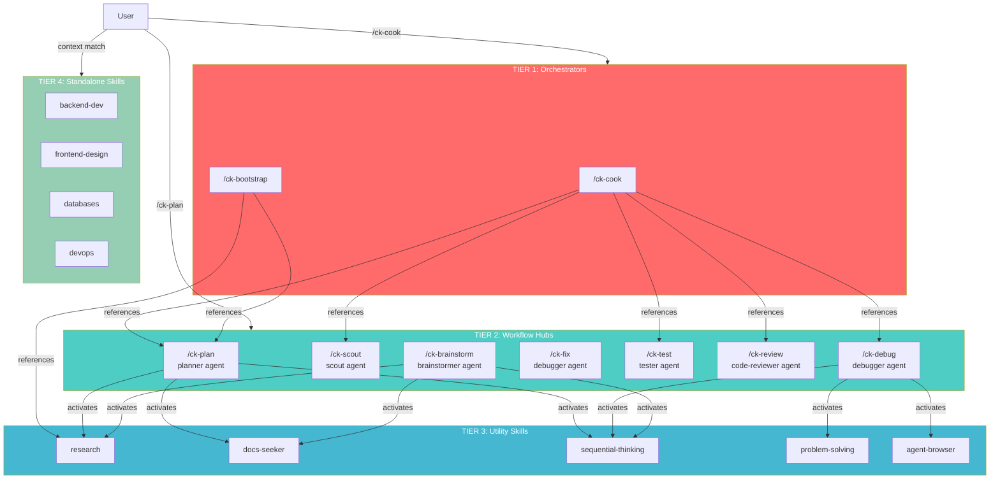

# ClaudeKit vs CoKit: 4-Tier Architecture Comparison Report

**Date:** 2026-02-25
**Author:** CoKit Engineering
**Audience:** Leadership / Technical Leads

---

## Executive Summary

ClaudeKit (Claude Code) uses a 4-tier hub-and-spoke architecture to organize 48+ skills into clear responsibility layers. CoKit adapts this same architecture for GitHub Copilot, but with fundamental changes due to Copilot's stateless, single-session model.

**Bottom line:** The 4-tier design philosophy is preserved. The implementation mechanism changes from **programmatic orchestration** (spawn subagents, send messages) to **text-based orchestration** (prompt references, agent personas, context-activated skills).

---

## The 4 Tiers at a Glance

```
┌──────────────────────────────────────────────────────────────────┐
│                                                                  │
│  TIER 1 ─ ORCHESTRATORS     "What to do, in what order"         │
│  Full lifecycle workflows: end-to-end feature implementation     │
│                                                                  │
│  TIER 2 ─ WORKFLOW HUBS     "How to do each step"               │
│  Domain-specific workflows: planning, debugging, testing, etc.   │
│                                                                  │
│  TIER 3 ─ UTILITY PROVIDERS "With what tools"                   │
│  Reusable capabilities: research, reasoning, docs lookup         │
│                                                                  │
│  TIER 4 ─ STANDALONE SKILLS "Domain knowledge on demand"        │
│  Independent experts: databases, devops, frontend, etc.          │
│                                                                  │
└──────────────────────────────────────────────────────────────────┘
```

**Communication rule:** Each tier only references the tier below it. No upward or lateral calls. This prevents circular dependencies.

---

## Side-by-Side Comparison

### Resource Counts

| Tier | ClaudeKit | CoKit | Delta | Notes |
|------|-----------|-------|-------|-------|
| **Tier 1** Orchestrators | 3 skills (cook, team, bootstrap) | 2 prompts (ck-cook, ck-bootstrap) | -1 | `team` dropped — Copilot lacks multi-session |
| **Tier 2** Workflow Hubs | 7 skills | 18 prompts + 12 agents | Expanded | Variants (ck-fix-types, ck-plan-fast) counted separately |
| **Tier 3** Utility Providers | 11 skills | 8 skills (+3 conditional) | -3 | Some external tools marked `(if available)` |
| **Tier 4** Standalone | 27 skills | 7 skills | -20 | Only high-demand skills ported; rest available on request |
| **Total** | **48** | **48 resources** | — | Different composition: prompts+agents+skills vs skills-only |

### Communication Mechanism

| Capability | ClaudeKit | CoKit |
|-----------|-----------|-------|
| Tier 1 → Tier 2 | `Task(subagent_type="planner")` — spawn separate agent process | Prompt text: "Use `planner` agent" — same session follows instructions |
| Tier 2 → Tier 3 | Skill invocation via `/skill-name` or `Task()` | Agent description: "activate `sequential-thinking` skill" — Copilot loads by context |
| Inter-agent messaging | `SendMessage` tool between parallel sessions | Not supported — single session, sequential execution |
| Review gates | `EnterPlanMode` / `ExitPlanMode` API | Natural language: "Review checkpoint: approve before continuing?" |
| Session state | Stateful — tracks phases, progress across turns | Stateless — each message is independent |
| Hooks | `SessionStart`, `UserPrompt` trigger automation | Not supported — logic embedded directly in prompts |

---

## Key Changes by Tier

### Tier 1: Orchestrators

| Change | Detail |
|--------|--------|
| `team` removed | Copilot cannot spawn parallel agent sessions. No equivalent exists. Users chain prompts manually instead. |
| Orchestration via text | ClaudeKit's `cook` spawns 7+ subagents programmatically. CoKit's `/ck-cook` is a prompt that instructs one Copilot agent to follow steps sequentially. |
| Mode detection preserved | Both parse user input for `--fast`, `--auto`, `--parallel` flags. CoKit reads from `${input}` instead of `$ARGUMENTS`. |

### Tier 2: Workflow Hubs

| Change | Detail |
|--------|--------|
| Prompt + Agent pairs | Each ClaudeKit skill becomes TWO CoKit resources: a `.prompt.md` (workflow) + `.agent.md` (expertise persona). |
| Variant prompts | ClaudeKit uses sub-commands (`/fix:types`). CoKit creates separate prompt files (`ck-fix-types.prompt.md`) because Copilot doesn't support colon syntax. |
| Navigation footer | Each CoKit prompt includes "Suggested Next Steps" table linking to related prompts — manual workflow chaining replacing ClaudeKit's automatic delegation. |
| Dual invocation | User can call `/ck-plan` directly OR `/ck-cook` references `planner` agent automatically. Same behavior, different entry point. |

### Tier 3: Utility Providers

| Change | Detail |
|--------|--------|
| Context activation | ClaudeKit calls skills programmatically. CoKit skills activate when Copilot matches task context to skill description — no explicit call needed. |
| `(if available)` qualifier | External tools not bundled with CoKit (`repomix`, `ai-multimodal`, `media-processing`) are marked with `(if available)` so agents gracefully degrade. |
| Renamed: `chrome-devtools` → `agent-browser` | Different tool name in CoKit ecosystem. |
| Removed: `ui-ux-pro-max`, `media-processing` | Not yet ported; available as ClaudeKit-only with `(if available)` qualifier. |

### Tier 4: Standalone Skills

| Change | Detail |
|--------|--------|
| 27 → 7 skills ported | Only high-demand, platform-agnostic skills ported: backend-development, databases, devops, frontend-design, ui-styling, web-testing, git, mcp-management. |
| 20 skills deferred | Domain-specific skills (shopify, threejs, shader, better-auth, payment-integration, mobile-development, etc.) deferred due to low demand. Can be ported on request. |
| Instruction pairing | CoKit adds `.instructions.md` files that auto-apply by file pattern (e.g., `ck-frontend.instructions.md` applies to `**/*.tsx`). ClaudeKit doesn't have this. |

---

## Platform Limitations & Workarounds

| Copilot Limitation | ClaudeKit Had | CoKit Workaround |
|-------------------|---------------|-----------------|
| No subagent spawning | `Task()` API for parallel agents | Agent references in natural language; sequential execution |
| No inter-agent messaging | `SendMessage` between sessions | Single session — no messaging needed |
| No plan approval flow | `EnterPlanMode` / `ExitPlanMode` | Text-based checkpoints in prompts |
| Stateless sessions | Persistent state across turns | File-based state (plan.md, reports/) + manual prompt chaining |
| No hooks | Session/prompt hooks for automation | Logic embedded in prompt templates |
| No `$ARGUMENTS` variable | Dynamic input passing | `${input}` Copilot variable |
| No multi-session teams | Team skill with 4+ parallel sessions | Manual workflow chaining by user |

---

## What CoKit Gains Over ClaudeKit

| CoKit Advantage | Detail |
|----------------|--------|
| **Instructions system** | Auto-applied coding standards by file pattern — ClaudeKit doesn't have this |
| **Collections** | Bundled resource sets for team deployment — new concept |
| **Simpler deployment** | `npx cokit-cli init` — one command install vs manual `.claude/` setup |
| **Lower barrier** | Works with any Copilot subscription; no Claude API key needed |
| **Wider IDE support** | VS Code, JetBrains, Neovim — anywhere Copilot runs |

---

## Architecture Diagram



---

## Summary

The 4-tier architecture successfully translates from ClaudeKit to CoKit with the core design philosophy intact:

1. **Tier structure preserved** — Same separation of concerns, same hub-and-spoke pattern
2. **Communication adapted** — Programmatic → text-based references (Copilot's model)
3. **Scope right-sized** — 7 standalone skills vs 27 (demand-driven porting)
4. **New capabilities added** — Instructions, Collections, CLI installer
5. **Key trade-off** — Lost multi-session parallelism (`team`), gained wider IDE/platform reach
