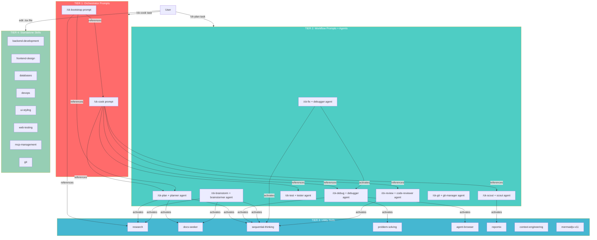

# CoKit 4-Tier Architecture

## Overview

CoKit adapts ClaudeKit's **hub-and-spoke** architecture into 4 tiers, redesigned for GitHub Copilot's stateless, prompt-driven model.

**Key difference from ClaudeKit:** Copilot does NOT spawn subagents programmatically. Instead, tiers communicate through **prompt references**, **agent delegation in natural language**, and **skill activation by context**. All orchestration happens within a single Copilot agent session.

```
┌─────────────────────────────────────────────────────────────────────────┐
│                                                                         │
│   TIER 1 ── ORCHESTRATOR PROMPTS (Chỉ huy)                            │
│   ┌──────────────┐  ┌──────────────┐                                   │
│   │  /ck-cook    │  │ /ck-bootstrap│                                   │
│   │  (end-to-end │  │ (project     │                                   │
│   │  implement)  │  │  scaffolding)│                                   │
│   └────┬─────────┘  └─────┬────────┘                                   │
│        │                   │                                            │
│   ─────┼───────────────────┼──── references agents + invokes prompts    │
│        ▼                   ▼                                            │
│   TIER 2 ── WORKFLOW PROMPTS + AGENTS (Quản lý trung gian)            │
│   ┌────────┐ ┌─────────┐ ┌─────────┐ ┌───────┐ ┌────────┐ ┌────────┐ │
│   │/ck-plan│ │/ck-scout│ │/ck-debug│ │/ck-fix│ │/ck-test│ │/ck-    │ │
│   │planner │ │scout    │ │debugger │ │debugger│ │tester  │ │review  │ │
│   │agent   │ │agent    │ │agent    │ │agent  │ │agent   │ │code-   │ │
│   │        │ │         │ │         │ │       │ │        │ │reviewer│ │
│   └──┬─────┘ └──┬──────┘ └──┬──────┘ └──┬────┘ └──┬─────┘ └──┬─────┘ │
│      │          │           │           │         │           │       │
│   ───┼──────────┼───────────┼───────────┼─────────┼───────────┼────── │
│      ▼          ▼           ▼           ▼         ▼           ▼       │
│   TIER 3 ── UTILITY SKILLS (Công cụ thuần tuý)                       │
│   ┌──────────┐ ┌─────────────┐ ┌────────────────┐ ┌────────────┐     │
│   │ research │ │docs-seeker  │ │sequential-     │ │problem-    │     │
│   │          │ │             │ │thinking        │ │solving     │     │
│   ├──────────┤ ├─────────────┤ ├────────────────┤ ├────────────┤     │
│   │repomix   │ │agent-browser│ │context-        │ │mermaidjs   │     │
│   │(if avail)│ │             │ │engineering     │ │-v11        │     │
│   └──────────┘ └─────────────┘ └────────────────┘ └────────────┘     │
│                                                                       │
│   TIER 4 ── STANDALONE SKILLS (Chuyên gia độc lập)                   │
│   ┌────────────┐ ┌────────────┐ ┌────────────┐ ┌────────────┐        │
│   │backend-    │ │databases   │ │devops      │ │frontend-   │        │
│   │development │ │            │ │            │ │design      │        │
│   ├────────────┤ ├────────────┤ ├────────────┤ ├────────────┤        │
│   │ui-styling  │ │web-testing │ │git         │ │mcp-        │        │
│   │            │ │            │ │            │ │management  │        │
│   └────────────┘ └────────────┘ └────────────┘ └────────────┘        │
│                                                                       │
└───────────────────────────────────────────────────────────────────────┘
```

---

## ClaudeKit vs CoKit: Adaptation Map

Before diving into tiers, understand what changes and what stays the same.

| Aspect | ClaudeKit (Claude Code) | CoKit (Copilot) |
|--------|------------------------|-----------------|
| **Subagent spawning** | `Task(subagent_type="researcher")` | Reference `researcher` agent in natural language |
| **Inter-agent messaging** | `SendMessage` tool | Not supported — single session |
| **Plan mode** | `EnterPlanMode / ExitPlanMode` | Not supported — prompt-driven gates |
| **Session state** | Stateful across turns | Stateless per-message |
| **Hooks** | `SessionStart`, `UserPrompt` hooks | Not supported — embed in prompts |
| **Skill invocation** | `/skill-name` slash command | Activate by context or describe in prompt |
| **Agent spawning** | Programmatic `Task()` tool | `agent: 'agent'` frontmatter + natural language delegation |
| **Variables** | `$ARGUMENTS` | `${input}` |
| **Multi-session** | `team` skill spawns parallel sessions | Not supported |
| **Review gates** | Programmatic with approval flow | Natural language checkpoints in prompt |

### What this means for each tier

- **Tier 1**: Orchestrators become **prompt templates** that describe the full workflow in text. The agent reads the prompt and follows steps sequentially, referencing other prompts/agents by name.
- **Tier 2**: Workflow hubs are **prompt + agent pairs**. Each prompt defines the workflow; each agent defines the persona/expertise.
- **Tier 3**: Utility providers are **skills activated by context**. Agents mention them in their instructions: "activate `sequential-thinking` skill for complex analysis."
- **Tier 4**: Standalone skills work identically — self-contained domain knowledge.

---

## Tier 1: Orchestrator Prompts (Tầng Chỉ Huy)

### Vai trò
**Workflow controllers** — Prompt templates defining end-to-end workflows. They describe the full process from start to finish, referencing which agents and prompts to use at each step.

### Đặc điểm Copilot
- **Prompt-driven**: Workflow defined entirely in the prompt markdown, not programmatic
- **Single session**: All steps run in one Copilot agent session (no multi-session)
- **Natural language gates**: Review checkpoints written as instructions, not API calls
- **Agent references**: "Use `planner` agent" instead of `Task(subagent_type="planner")`
- **Mode detection via text**: Parse `${input}` for flags like `--fast`, `--auto`

### Thành viên

| Prompt | Agent mode | Mô tả | References |
|--------|-----------|--------|------------|
| **`/ck-cook`** | `agent: 'agent'` | End-to-end implementation. Detect intent → Scout → Plan → Implement → Simplify → Test → Review → Finalize | `planner`, `scout`, `researcher`, `tester`, `debugger`, `code-reviewer`, `code-simplifier`, `docs-manager`, `git-manager` agents |
| **`/ck-bootstrap`** | `agent: 'agent'` | New project scaffolding. Research → Design → Plan → Implement | `researcher`, `planner` agents; `research`, `planning` skills |

### Adaptation note: `team` skill

ClaudeKit's `team` orchestrator spawns parallel Claude Code sessions. Copilot does NOT support multi-session agent spawning. CoKit does **not** include a `team` equivalent. For parallel work, users chain prompts manually:

```
/ck-plan Build auth     →  (approve plan)  →  /ck-cook plans/auth/plan.md
```

### Ví dụ luồng `/ck-cook` trong Copilot

```
User: /ck-cook Add user auth --fast

Copilot reads ck-cook.prompt.md:
  │
  ├─ Parse ${input} → detect "fast" → skip research
  ├─ Step 1: Activate scout skill, search codebase
  ├─ Step 2: Activate planning skill, create plan
  ├─ Step 3: Implement code changes
  ├─ Step 4: Activate code-simplifier agent to refine
  ├─ Step 5: "Review checkpoint: approve before testing?"
  ├─ Step 6: Run tests (activate test skill)
  ├─ Step 7: Activate code-reviewer agent
  └─ Step 8: Update docs, suggest /ck-git
```

**Key difference**: In ClaudeKit, cook spawns separate agents via `Task()`. In CoKit, the single Copilot agent follows the prompt instructions sequentially, activating skills and referencing agent personas as needed.

---

## Tier 2: Workflow Prompts + Agents (Tầng Quản Lý Trung Gian)

### Vai trò
**Domain-specific workflow executors** — Each is a **prompt + agent pair**. The prompt defines the workflow template; the agent defines specialized expertise. Users invoke directly OR Tier 1 orchestrators reference them.

### Đặc điểm Copilot
- **Dual invocation**: User calls `/ck-plan` directly, OR `/ck-cook` prompt references `planner` agent
- **Prompt = workflow**: The `.prompt.md` file IS the workflow definition
- **Agent = persona**: The `.agent.md` file defines expertise, tools, and approach
- **Skill activation**: Agents describe which skills to activate: "Use `debug` skill", "Activate `sequential-thinking` skill"
- **Suggested Next Steps**: Each prompt includes navigation footer linking to related prompts

### Thành viên

| Prompt | Agent | Mô tả | Activates Skills |
|--------|-------|--------|-----------------|
| **`/ck-plan`** | `planner` | Create implementation plans. Research → Analyze → Design → Document | `planning`, `research`, `docs-seeker`, `sequential-thinking` |
| **`/ck-plan-fast`** | `planner` | Quick plan, skip research | `planning` |
| **`/ck-plan-hard`** | `planner` | Thorough plan + red team + validation | `planning`, `research` |
| **`/ck-scout`** | `scout` | Fast codebase scouting with parallel search | `scout`, `repomix` (if available) |
| **`/ck-debug`** | `debugger` | Systematic debugging with root cause analysis | `debug`, `sequential-thinking` |
| **`/ck-fix`** | `debugger` | Fix bugs: investigate first, then fix | `fix`, `debug`, `sequential-thinking` |
| **`/ck-fix-types`** | `debugger` | Fix TypeScript type errors | `fix` |
| **`/ck-fix-test`** | `debugger` | Fix failing tests | `fix`, `debug` |
| **`/ck-fix-ci`** | `debugger` | Fix CI/CD pipeline failures | `fix`, `debug` |
| **`/ck-fix-ui`** | `debugger` | Fix visual/UI bugs | `fix`, `agent-browser` |
| **`/ck-test`** | `tester` | Run tests, analyze coverage, validate | `web-testing` |
| **`/ck-review`** | `code-reviewer` | Code review with quality gates | `code-review`, `sequential-thinking` |
| **`/ck-brainstorm`** | `brainstormer` | Brainstorm with trade-off analysis | `brainstorm`, `research`, `docs-seeker` |
| **`/ck-simplify`** | `code-simplifier` | Refactor code for clarity | N/A |
| **`/ck-git`** | `git-manager` | Commit, push, PR workflows | `git` |
| **`/ck-docs`** | `docs-manager` | Update/create documentation | `docs-seeker` |
| **`/ck-ask`** | (none) | Answer technical questions | Context-dependent |
| **`/ck-watzup`** | (none) | Review recent changes, wrap up | `git` |

### Variant prompts (not counted as separate commands)

Variants are sub-routes of a parent prompt. They share the same agent but modify behavior:

| Parent | Variants |
|--------|----------|
| `/ck-plan` | `/ck-plan-fast`, `/ck-plan-hard`, `/ck-plan-validate`, `/ck-plan-red-team` |
| `/ck-fix` | `/ck-fix-types`, `/ck-fix-test`, `/ck-fix-ci`, `/ck-fix-fast`, `/ck-fix-hard`, `/ck-fix-logs`, `/ck-fix-ui` |

### Sự khác biệt với Tier 1

```
┌──────────────────────────────────────────────────────────────┐
│  TIER 1 (/ck-cook):                                         │
│  "Full workflow A → Z, references multiple agents/prompts"  │
│  Scout → Plan → Implement → Simplify → Test → Review → Git  │
│                                                              │
│  TIER 2 (/ck-plan):                                         │
│  "Single domain, deep workflow within that domain"           │
│  Research → Codebase analysis → Design → Write plan.md       │
└──────────────────────────────────────────────────────────────┘
```

---

## Tier 3: Utility Skills (Tầng Công Cụ Thuần Tuý)

### Vai trò
**Capability providers** — Skills providing specialized knowledge or methodology. Activated by context when agents/prompts mention them. Stateless, single-purpose, no skill-to-skill dependencies.

### Đặc điểm Copilot
- **Context-activated**: Copilot loads skill when agent mentions it or task matches skill description
- **No programmatic call**: Unlike ClaudeKit's `Task()`, skills are activated by Copilot's context matching
- **Leaf nodes**: Never activate other skills — they ARE the leaf expertise
- **Reusable**: Multiple agents reference the same skill
- **`(if available)` qualifier**: External tools not bundled with CoKit need this qualifier

### Thành viên

| Skill | Capability | Referenced by |
|-------|-----------|---------------|
| **research** | Web search, docs synthesis, technical reports | `planner`, `brainstormer` agents; `/ck-plan`, `/ck-brainstorm` |
| **docs-seeker** | Library/framework docs via llms.txt (context7) | `planner`, `brainstormer`, `debugger` agents |
| **sequential-thinking** | Step-by-step reasoning with revision & branching | `debugger`, `planner`, `brainstormer`, `code-reviewer` agents |
| **problem-solving** | Systematic techniques for stuck-ness | `debugger` agent |
| **agent-browser** | Browser automation CLI (replaces ClaudeKit's `chrome-devtools`) | `debugger`, `tester` agents |
| **repomix** (if available) | Pack repo into AI-friendly file | `scout` agent |
| **context-engineering** | Token optimization, context monitoring | Any agent when context-constrained |
| **mermaidjs-v11** | Mermaid diagram syntax v11 | `planner` agent, visual generation |
| **ui-ux-pro-max** (if available) | Design intelligence: styles, palettes, fonts | `ui-ux-designer` agent |
| **ai-multimodal** (if available) | Image/video/audio analysis via Gemini | Any agent needing vision |
| **media-processing** (if available) | FFmpeg/ImageMagick media processing | Any agent needing media ops |

### CoKit naming note

In CoKit's installed structure, skills use the `ck-` prefix in their directory names (e.g., `~/.copilot/skills/ck-sequential-thinking/`). But in agent/prompt references, use the short name without prefix: "activate `sequential-thinking` skill".

### Why separate tier?

```
                    ┌──────────────────┐
    ┌──────────────>│  sequential-     │<──────────────┐
    │               │  thinking skill  │               │
    │               └──────────────────┘               │
    │                      ▲                           │
┌───┴────────┐      ┌──────┴──────────┐       ┌───────┴──┐
│ debugger   │      │ code-reviewer   │       │ planner  │
│ agent      │      │ agent           │       │ agent    │
└────────────┘      └─────────────────┘       └──────────┘

→ 1 skill serves MANY agents = DRY principle
→ Each skill can be updated independently
→ No circular dependencies
→ Copilot loads skill only when context matches = token efficient
```

---

## Tier 4: Standalone Skills (Tầng Chuyên Gia Độc Lập)

### Vai trò
**Domain-specific experts** — Self-contained knowledge packages. Users activate directly when they need specialized expertise. No dependency on CoKit core prompts/agents.

### Đặc điểm Copilot
- **Self-contained**: Full knowledge + methodology in one skill package
- **No CoKit core dependency**: Works without `/ck-cook`, `/ck-plan`, etc.
- **Context-activated**: Copilot loads when editing matching files or user describes matching task
- **Pluggable**: Add new skill = create `skills/ck-name/SKILL.md` + `references/`. No changes needed elsewhere.
- **Instruction-paired**: Some pair with instructions (e.g., `ck-frontend` instruction + `frontend-design` skill)

### Thành viên (CoKit has fewer than ClaudeKit — only skills that have been ported)

| Category | Skills in CoKit |
|----------|----------------|
| **Backend** | `backend-development`, `databases`, `devops` |
| **Frontend** | `frontend-design`, `ui-styling` |
| **Testing** | `web-testing` |
| **Git** | `git` |
| **MCP** | `mcp-management` |
| **Browser** | `agent-browser` |

### Skills NOT in CoKit (ClaudeKit-only, or external)

These exist in ClaudeKit but are NOT ported to CoKit. If referenced by agents, they use `(if available)`:

| Skill | Reason not ported |
|-------|-------------------|
| `shopify`, `threejs`, `shader` | Domain-specific, low demand |
| `better-auth`, `payment-integration` | Domain-specific |
| `mobile-development`, `remotion` | Domain-specific |
| `mintlify`, `copywriting` | Domain-specific |
| `google-adk-python`, `mcp-builder` | Domain-specific |
| `ai-multimodal`, `media-processing` | External dependency (Gemini API) |
| `ui-ux-pro-max` | Not yet ported |
| `web-frameworks`, `web-design-guidelines` | Not yet ported |

### When user needs an unported skill

```
User: "I need to build a Shopify checkout extension"

Copilot behavior:
  → No shopify skill in CoKit
  → Falls back to general knowledge + web search
  → User can manually install from ClaudeKit if needed
```

---

## Communication Flow in Copilot



**How arrows work in Copilot:**
- **"references"** = Prompt text says "Use `planner` agent" or "Run `/ck-scout`" — Copilot follows these as instructions
- **"activates"** = Agent description says "activate `sequential-thinking` skill" — Copilot loads skill context when task matches

---

## Comparison Table

| | Tier 1 | Tier 2 | Tier 3 | Tier 4 |
|--|--------|--------|--------|--------|
| **Name** | Orchestrator Prompts | Workflow Prompts + Agents | Utility Skills | Standalone Skills |
| **CoKit count** | 2 prompts | 18 prompts + 12 agents | 8 skills (+3 if available) | 7 skills |
| **Role** | End-to-end workflow | Domain workflow | Capability provider | Domain expert |
| **Copilot resource** | `.prompt.md` | `.prompt.md` + `.agent.md` | `SKILL.md` | `SKILL.md` |
| **Invocation** | User calls prompt | User OR Tier 1 references | Context activation | Context activation |
| **References others?** | Tier 2 agents + prompts | Tier 3 skills | No | No |
| **Scope** | Full feature lifecycle | Single concern | Single capability | Single domain |
| **Examples** | /ck-cook, /ck-bootstrap | /ck-plan, /ck-fix, /ck-test | research, sequential-thinking | backend-dev, databases |

---

## Design Principles (CoKit-adapted)

### 1. Hub-and-Spoke via Text References
No programmatic subagent spawning. Orchestrator prompts reference workflow agents by name. Agents reference utility skills by name. Copilot follows these as natural language instructions.

### 2. Separation of Concerns
- Tier 1: **What** to do and in what order (strategy)
- Tier 2: **How** to do each step (domain tactics)
- Tier 3: **With what** methodology (reusable capabilities)
- Tier 4: **Domain knowledge** on demand (specialized expertise)

### 3. DRY via Shared Skills
`sequential-thinking` skill referenced by `debugger`, `planner`, `code-reviewer`, and `brainstormer` agents. Written once in `skills/sequential-thinking/SKILL.md`, activated by any agent that needs structured reasoning.

### 4. Pluggable Architecture
Add a new standalone skill = create `skills/ck-new-skill/SKILL.md`. No changes needed to any prompt or agent file. Copilot discovers it by context.

### 5. Graceful Degradation
External tools use `(if available)` qualifier. If `repomix` CLI is not installed, `scout` agent falls back to built-in search. If `ai-multimodal` skill is not available, agents use Copilot's native capabilities.
